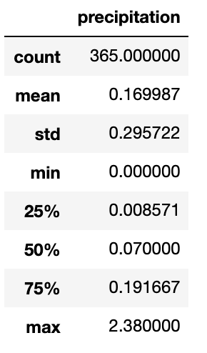
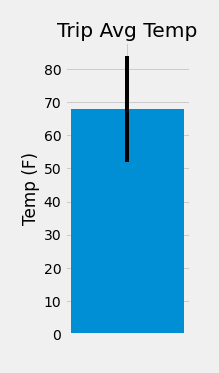

# sqlalchemy-challenge

> Application of the skills learned about Data Engineering and Data Analysis using SQLAlchemy ORM queries, Pandas, and Matplotlib

## Table of contents
* [Climate Analysis and Exploration](#Climate-Analysis-and-Exploration)
* [Precipitation Analysis](#Precipitation-Analysis)
* [Station Analysis](#Station-Analysis)
* [Temperature Analysis I](#Temperature-Analysis-I)
    * [Observations](#Observations)
* [Temperature Analysis II](#Temperature-Analysis-II)
* [Daily Temperature Average](#Daily-Temperature-Average)
* [Contact](#Contact)

## Climate Analysis and Exploration
Basic climate analysis and data exploration of a climate database.

### Precipitation Analysis

Bar chart of precipitation values from the last 12 months of precipitation data (from the most recent date in the database).

Summary statistics for the precipitation data.

### Station Analysis

Histogram of the last 12 months of temperature observation data (TOBS) for the most active station.

### Temperature Analysis I

#### Observations
* I used an unpaired or Independent t-test since we are comapring two separate sets of independent samples.

* The small t-score of 6.92 indicates that the 2 samples are similar.

* The calculated p-value is 1.4518830376438732e-05, which is < 0.05. This means that here is a statistical difference between the June and December temperatures.

### Temperature Analysis II

Bar chart of average temparature for previous year of trip dates

### Daily Temperature Average
Area plot of max, min and avg temperature(daily normals).

## Contact
Created by [@deepavadakan](https://github.com/)